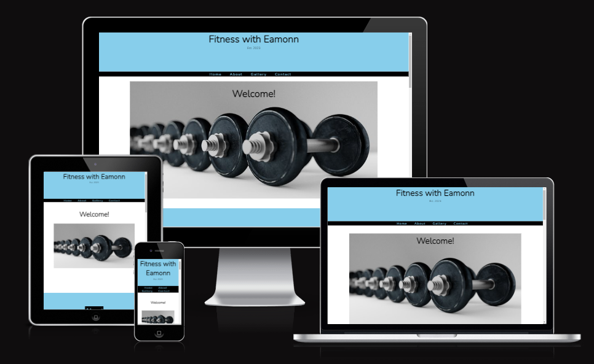
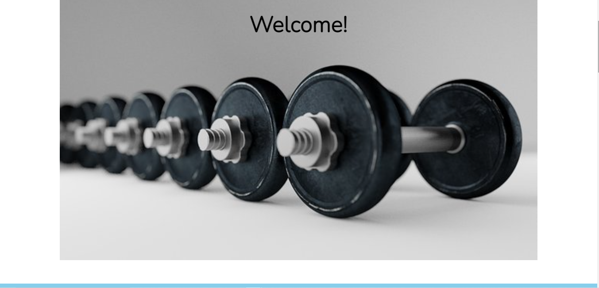
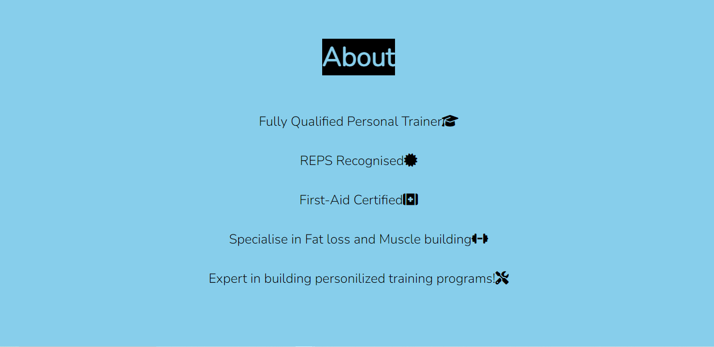
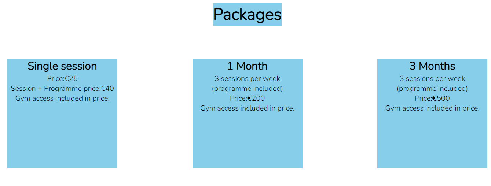
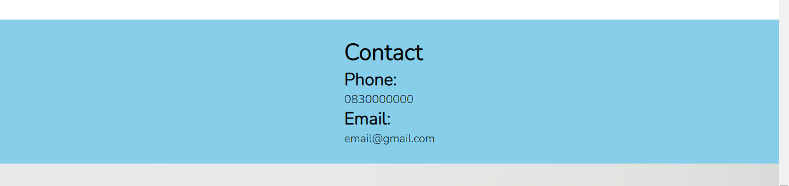
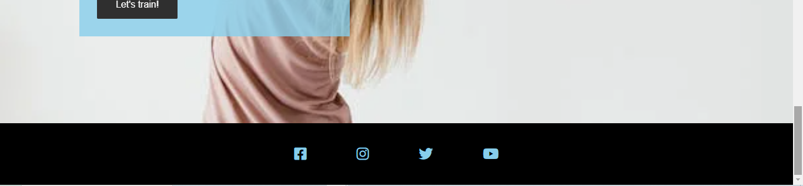
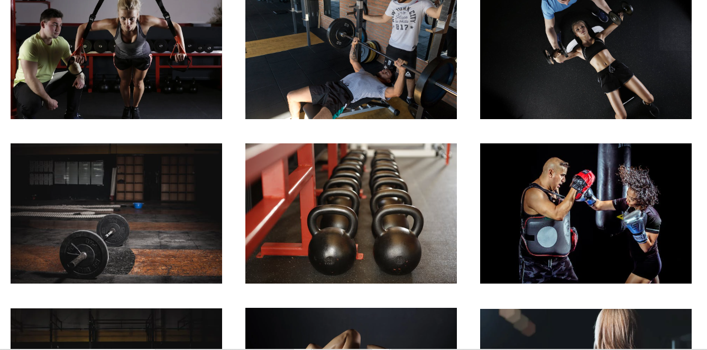

<h1>Fitness with Eamonn</h1>

This is a Personal Training website. You can find here details about the personal trainers qualifications, what packages are on offer, communication details, social media links, a gallery of images relating to the service and a tool to submit what package you would like to purchase.

<h1>Features</h1>
<h2>Header</h2>

The header shows the name of the Personal Training business with use of a colur comination and font style which will feature througout the website

<h2>Navbar</h2>

The Navbar is located just below the header and consists of a Home, About, Gallery and Contact Icon. These change colour when hovered over and bring you to that specific section of the website when clicked.

<h1>Hero Image</h1>

For the Hero image, there is a nice minimalistic photo of Dumbells and a Welcome header welcoming customers to the website.

<h2>About</h2>

The About section informs potential clients about the Qualifications and Certifications of the Personal Trainer and what he specialises in. Such as:

<ul>
<li>Being recognised by the fitness industry through REPS</li>
<li>That he is First Aid Trained</li>
<li>He specialises in Fat Loss and Muscle Building</li>
<li>He can design a personal program expertly</li>
</ul>
Icons are used to match the statements.

<h2>Packages</h2>

The Packages section shows the potential client of the packages available and the specific costs.

Each package is displayed in its own column wth the consistant colour scheme of the website contasting the columns.

<h2>Contact</h2>

The Contact section is a simple banner which show the potential client the business email address and phone number.

<h2>Choose Your Package</h2>

The choose your package section gives the customer the option of selecting a specific package.

You can enter your name and email address

You are then given three options

<ul>
<li>One Session</li>
<li>One Month</li>
<li>Three Months</li>
</ul>

Once selected you can click on the submit button and you selection is sent to the business

<h2>Footer</h2>

The footer is located on the bottom of all peges of the website.

It contains a row of social media icons which when clicked will bring you the website clicked.

The Icons consist of:

<ul>
<li>Facebook</li>
<li>Instagram</li>
<li>Twitter</li>
<li>Youtube</li>
</ul>

<h2>Gallery</h2>
<ul>
<li>The Gallery has its own page with the same Header and Footer.</li>
<li>It consists of 9 Images which shows Personal Trainers and Clients working out.</li>
<li>This page give a custumer a feel for the atmosphere they can expect.</li>
</ul>

