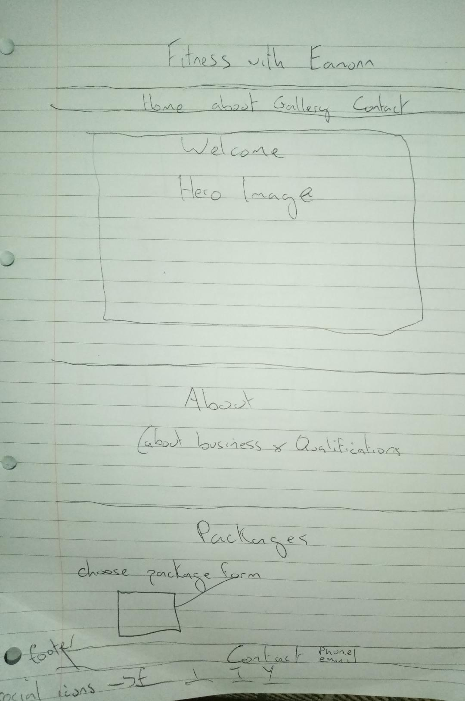
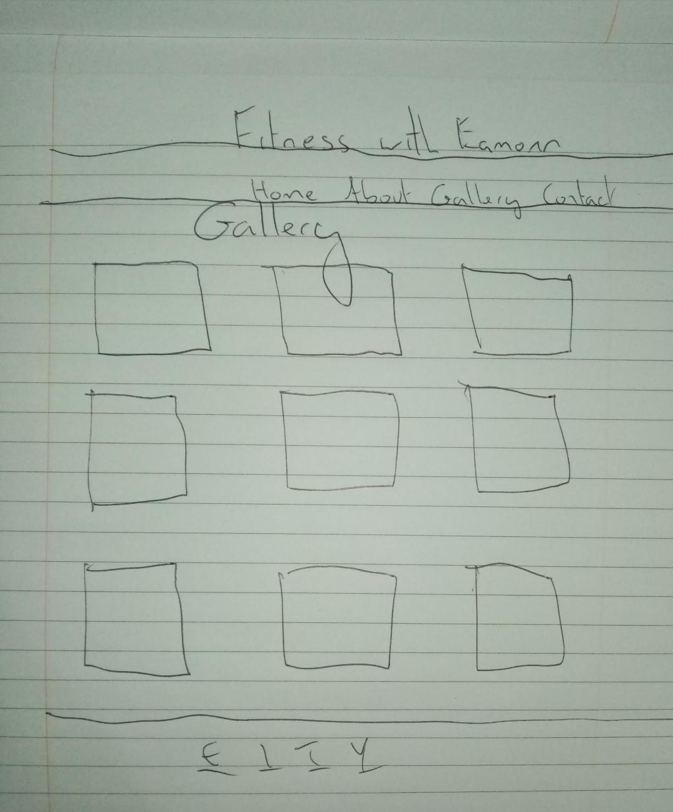
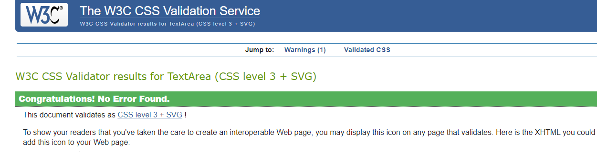
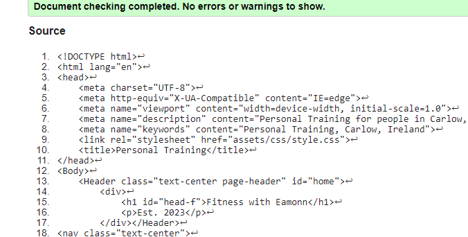
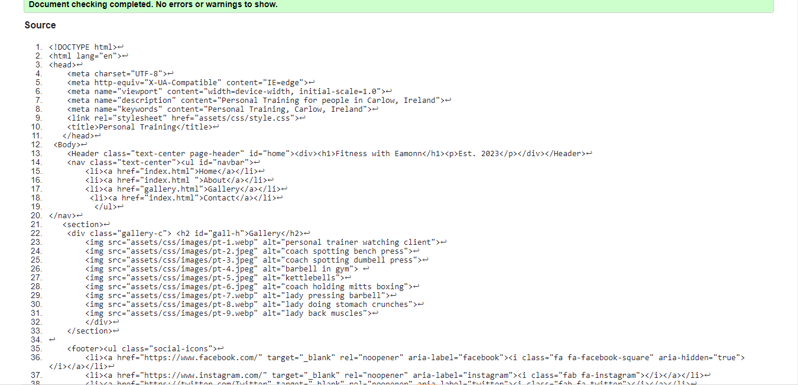
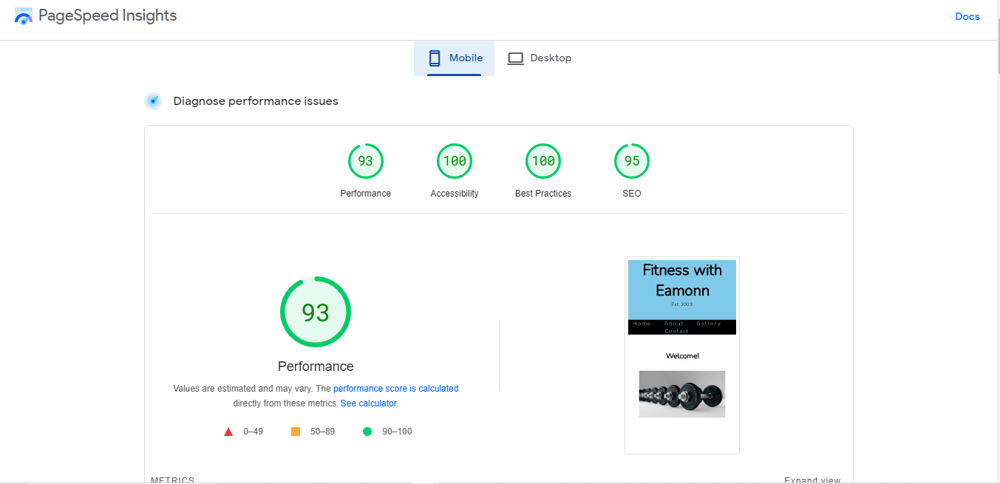
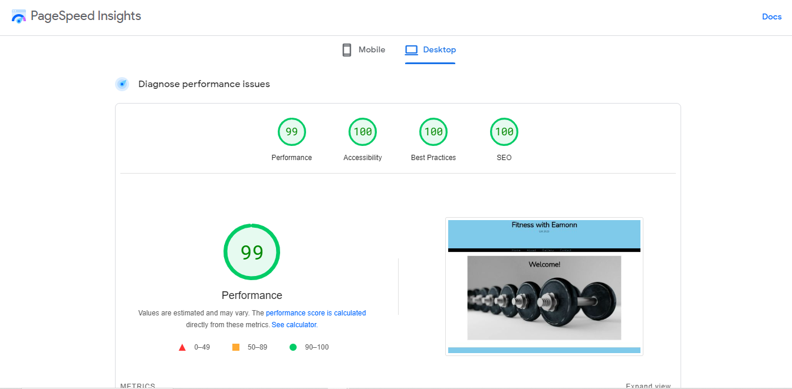

# Fitness with Eamonn [Click here to view the live Project.](https://eamonn5p.github.io/Fitness-with-Eamonn-/) 

This is a Personal Training website. You can find here details about the personal trainers qualifications, what packages are on offer, communication details, social media links, a gallery of images relating to the service and a tool to submit what package you would like to purchase.

# Features
## Header
The header shows the name of the Personal Training business with use of a colour comination and font style which will feature throughout the website
## Navbar
The Navbar is located just below the header and consists of a Home, About, Gallery and Contact Icon. These change colour when hovered over and bring you to that specific section of the website when clicked.<

# Hero Image
For the Hero image, there is a nice minimalistic photo of Dumbells and a Welcome header welcoming customers to the website.

# About
The About section informs potential clients about the Qualifications and Certifications of the Personal Trainer and what he specialises in. Such as:

- Being recognised by the fitness industry through REPS.
- That he is First Aid Trained.
- He specialises in Fat Loss and Muscle Building.
- He can design a personal program expertly

Icons are used to match the statements.

## Packages
The Packages section shows the potential client; the packages available and the specific costs.
Each package is displayed in its own column wth the consistant colour scheme of the website contrasting the columns.

## Contact
The Contact section is a simple banner which show the potential client, the business email address and phone number.

## Choose Your Package
The choose your package section gives the customer the option of selecting a specific package.
You can enter your name and email address
You are then given three options

- One Session
- One Month
- Three Months

Once selected, you can click on the submit button and your selection is sent to the business.

## Footer
The footer is located on the bottom of all pages of the website.
It contains a row of social media icons which when clicked will bring you the website clicked.
The Icons consist of:

- Facebook
- Instagram
- Twitter
- Youtube

## Gallery

- The Gallery has its own page with the same Header and Footer.
- It consists of 9 Images which shows Personal Trainers and Clients working out.
- This page give a customer a feel for the atmosphere they can expect.

## Wireframes
A simple pen and paper wireframe was used used as a guide to structure the website.

## Technologies Used

- HTML-5
- CSS-3

## Frameworks, Libraries & Programs Used

- [Flexbox:](https://css-tricks.com/snippets/css/a-guide-to-flexbox/) Flexbox was used for responsiveness and to add structure to the website.
- [Hover.css:](https://ianlunn.github.io/Hover/) Hover.css was used on the Navbar, Form and Social Media icons in the footer to change colour and underline while being hovered over.
- [Google Fonts:](https://fonts.google.com/) Google fonts were used to import the 'Nunito' and 'PT Sans' font into the style.css file which is used on all pages throughout the project.
- [Git:](https://git-scm.com/) Git was used for version control by utilizing the Gitpod terminal to commit to Git and Push to GitHub.
- [GitHub:](https://github.com/)GitHub is used to store the projects code after being pushed from Git.
- [Font Awesome:](https://fontawesome.com/)Font Awesome was used for icons on the About section and for social media icons on the footer.

## Testing

- The website was tested in different browers such as Chrome, Firefox and Safari.
- I checked the website was responsive on all standard screens and looks professional by using devtools on Chrome and https://ui.dev/amiresponsive.
- I have confirmed that the form works perfectly, it requires entries in every box and requires email and the Submit button works confirming the user has made a submission.
- I confirmed all information text on the website is clear and easy to see and understand.

## Bugs
### Solved Bugs
When I created the Gallery Page, the links for About and Contact were not working on the Navbar.
The reason for this was I had the same href as on the Main html page, I had to change the href to link it to the Home page.

# Validator Testing

- ## HTML 
No errors returned when passed through the official W3C Validator. [W3C Markup Validator](https://validator.w3.org/#validate_by_input)
- ## CSS
No errors returned when passed through the official (Jigsaw) Validator. [W3C CSS Validator](https://jigsaw.w3.org/css-validator/#validate_by_input)

# Accessibility
I confirmed the website is easy to read, accessible and high performing by running it through PageSpeed Insights. [Click here to view live Project.]
 [Click here to view live Project.]("https://pagespeed.web.dev/")

## Unfixed Bugs

- No unfixed bugs.

# Deployment
## GitHub Pages
The Site was deployed to GitHub Pages. The steps to deploy are as follows:

1. In the github repository, navigate to the settings tab.
2. From the source drop-down menu select the master branch.
3. Once the master branch was selected the page provided the link to the completed website.

The live link can be found here - [Click here to view live Project.](https://eamonn5p.github.io/Fitness-with-Eamonn-/)

# Clone
Making a local Clone

1. Log in to GitHub and locate the GitHub Repository.
2. Click on "Code" and the click "Clone" and copy the HTTPS URL.
3. Open Gitpod.
4. In the terminal type git clone and the paste the URL.
5. Press Enter and your clone will be created.

## Credits

- The code used for the form was customized from the Love Running (Code Institute) website.
- All Images used on this website were sourced from Pexels @ https://www.pexels.com/.

## Acknowledgements

- My Mentor for feedback.
- Slack Community for help with problem solving.
